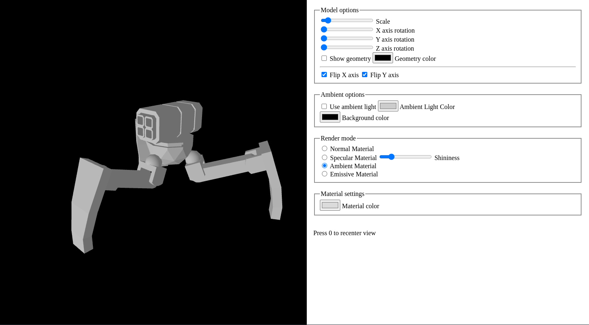
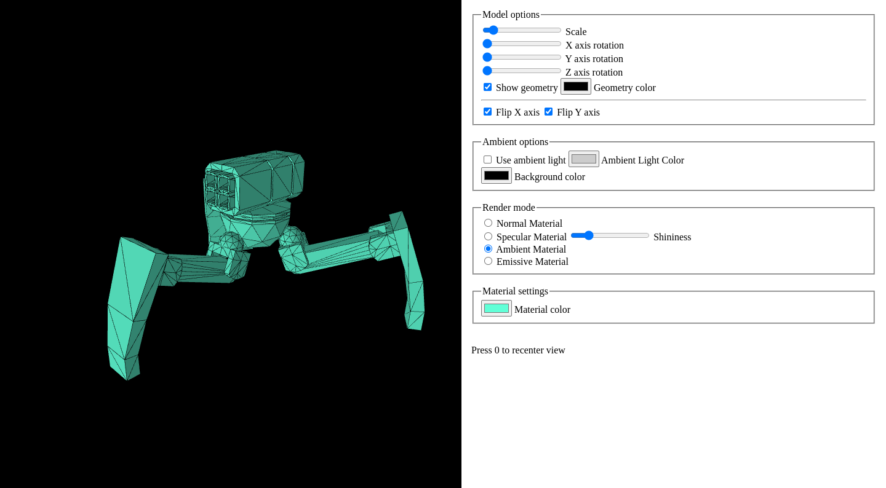
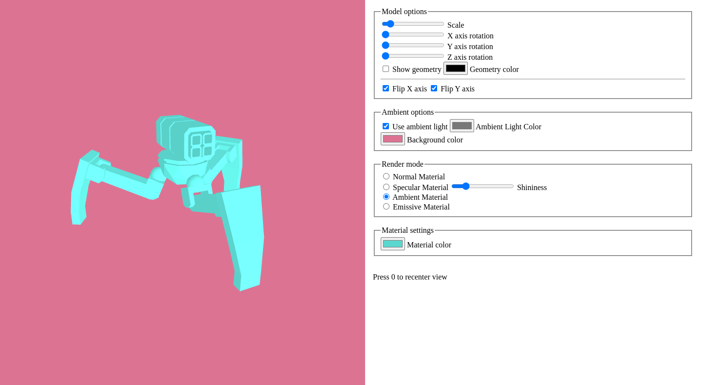
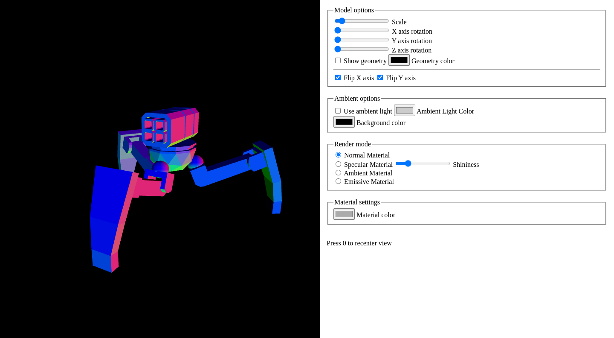

# Simple-3D-viewer
A simple 3D viewer for .obj file

To run this project, you have to stablish a local server. More information can be found [here]([https://](https://github.com/processing/p5.js/wiki/Local-server))

Inspect the mesh structure

Change several parameters of the viewer

Toggle normal visualization

This app is based on p5.js library. For any specific documentation, please refer to [p5.js]([https://](https://p5js.org/))